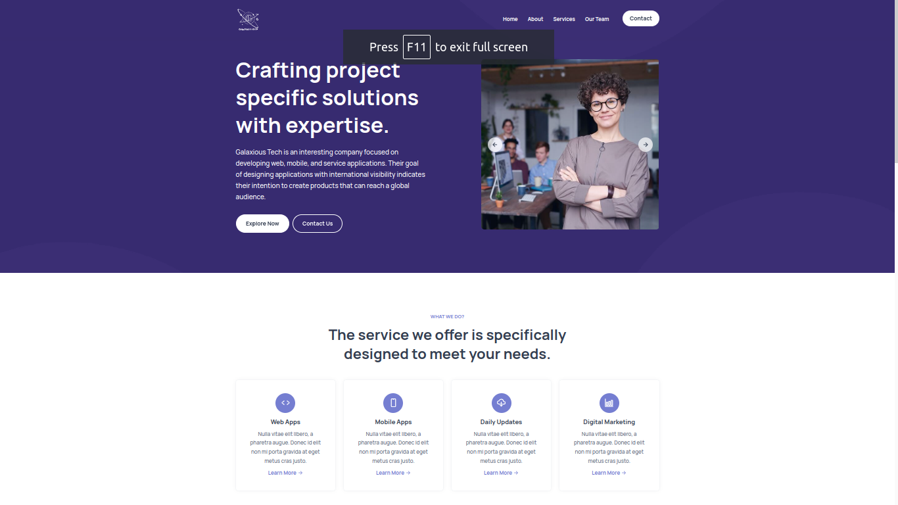

<div align="center">
  
  
  
  
  [](https://twitter.com/intent/follow?screen_name=__mass__g)
  

  <br />
  <br />

  <h2 align="center">Galaxious Tech</h2>

 Galaxious Tech is an interesting company focused on developing web, mobile, and service applications. Their goal of designing applications with international visibility indicates their intention to create products that can reach a global audience.

  <!-- <a href="https://codewithsadee.github.io/adex/"><strong>➥ Live Demo</strong></a> -->

</div>

<br />

### Demo Screeshots



### Prerequisites

Before you begin, ensure you have met the following requirements:

* [Git](https://git-scm.com/downloads "Download Git") must be installed on your operating system.

### Run Locally

To run **Galaxious Tech** locally, run this command on your git bash:

Linux and macOS:

```bash
sudo git clone https://github.com/mass-gueye/galaxioustech.git
```

Windows:

```bash
git clone https://github.com/mass-gueye/galaxioustech.git
```

### Contact

If you want to contact with me you can reach me at [Twitter](https://twitter.com/__mass__g).

### License

[MIT](https://choosealicense.com/licenses/mit/)
